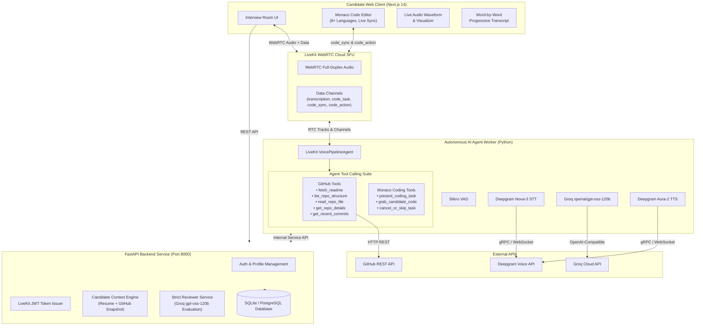
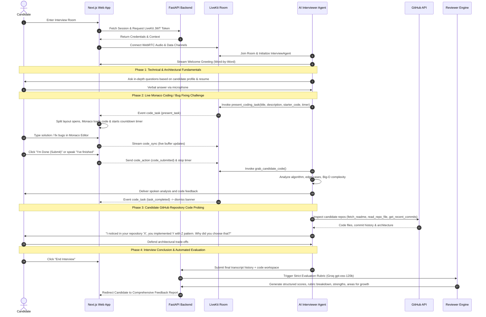

# 🎙️ InterviewME — Autonomous AI Technical Voice & Collaborative Coding Interviewer

<p align="center">
  <strong>An intelligent, end-to-end technical interview platform combining sub-second conversational voice WebRTC, collaborative in-browser Monaco code execution, deep GitHub repository codebase probing, and strict automated multi-dimensional rubric evaluations.</strong>
</p>

<p align="center">
  
  
  
  
  
  
</p>

---

## 🌟 Overview

**InterviewME** is an enterprise-grade AI technical interviewer that behaves just like a seasoned Principal Engineer conducting a live technical round. 

Unlike standard text chatbots or superficial voice clones, **InterviewME** combines:
1. **Low-Latency Conversational Voice**: Full-duplex voice streaming powered by LiveKit WebRTC, Silero Voice Activity Detection (VAD), Deepgram Nova-3 speech-to-text, and Deepgram Aura-2 text-to-speech.
2. **Collaborative Monaco Code Editor**: An integrated IDE supporting 8+ programming languages (Python, JavaScript, TypeScript, Go, Java, C++, Rust, SQL) with live countdown timers, live code streaming over WebRTC data channels, intentional bug hunting, and instant AI review.
3. **Deep GitHub Context & Repo Probing**: Directly inspects the candidate's actual public GitHub repositories, analyzes recent commits, reads code architectures, and quizzes candidates on design decisions in their own projects.
4. **Strict, Objective Rubric Reviewer**: Evaluates transcripts, code quality, and answers against a rigorous 100-point rubric (Technical Depth, Problem Solving, Communication, Code Quality, System Architecture) without inflated scores.

---

## 🏛️ System Architecture



---

## 🔄 End-to-End Interview Lifecycle



---

## ⚡ Key Features

### 1. Ultra-Low Latency Conversational Voice
- **Full-Duplex Interactivity**: Natural human conversational flow with zero awkward delays. You can interrupt the interviewer naturally at any point.
- **Deepgram Nova-3 Speech Recognition**: State-of-the-art multilingual transcription with instant candidate voice-to-text.
- **Word-by-Word Progressive Transcript Streaming**: Transcripts stream incrementally onto the screen in real-time as words are spoken, creating a dynamic visual pacing without delay or duplicate messages.
- **Deepgram Aura-2 Asteria Voice**: Clear, warm, natural human speech synthesis.

### 2. Collaborative Monaco Code Editor (Browser IDE)
- **Multi-Language Support**: Choose between Python, JavaScript, TypeScript, Go, Java, C++, Rust, or SQL.
- **Two Interview Modes**:
  - `write_code`: Implement an optimal algorithm from scratch.
  - `fix_bug`: Diagnose, isolate, and repair tricky real-world concurrency, boundary, or logic bugs.
- **Real-Time Data Channel Synchronization**: Editor keystrokes sync debounced over WebRTC to the agent without requiring server compute to execute code.
- **Challenge Countdown Timer**: Displays visual timers with alert states (amber < 60s, red < 30s). Freezes instantly upon completion or rejection.
- **Quick Controls**:
  - `I'm Done (Submit)`: Stops the countdown, locks the submission, and triggers the AI to immediately inspect your code and give feedback.
  - `Clear Code`: Cleans the workspace back to the starter template.
  - `Reject / Skip`: Declines a challenge if out-of-scope and moves to an alternative topic.

### 3. Real GitHub Codebase Inspection (Tool Calling)
The AI agent doesn't guess what you built—it reads your code:
- `fetch_github_readme`: Grabs and reads the README of any candidate project.
- `list_github_repo_structure`: Explores directory trees and module boundaries.
- `read_github_repo_file`: Reads actual implementation files to quiz you on functions, error handling, and class designs.
- `get_github_repo_details`: Evaluates stars, primary languages, open issues, and topics.
- `get_github_recent_commits`: Checks commit velocity and engineering practices.

### 4. Strict, Multi-Dimensional Rubric Evaluator
- **Unforgiving 0-100 Scoring**: If a candidate only exchanges pleasantries or fails to solve a challenge, scores accurately reflect that rather than flattering inflated scores.
- **5 Granular Rubric Dimensions**:
  - **Technical Depth** (0-20)
  - **Problem Solving & Live Coding** (0-20)
  - **Communication & Clarity** (0-20)
  - **Code Quality & Edge Cases** (0-20)
  - **System Architecture & Design** (0-20)
- **Detailed Evaluation Output**:
  - Executive hiring verdict (`Strong Hire`, `Hire`, `Weak Hire`, `Do Not Hire`).
  - Candidate summary.
  - Key strengths identified.
  - Critical areas for improvement with actionable suggestions.
  - Full turn-by-turn spoken transcript and code snapshot archive.

### 5. Modern Clean Light Theme UI
- Reorganized split layout: Spoken dialogue on the left with audio visualizers, spacious Monaco Editor on the right.
- Focus Modes: Switch between `Split View`, `Voice Only`, or `Code Focus` seamlessly.
- Responsive design crafted with custom CSS variables, clean typography, and zero dark-theme bleeding.

---

## 📂 Project Structure

```
InterviewME/
├── apps/
│   ├── web/                           # Next.js 14 Frontend Application
│   │   ├── src/
│   │   │   ├── app/                   # App Router pages (/dashboard, /interview/[id], /onboarding)
│   │   │   │   ├── globals.css        # Clean, modern light theme design system
│   │   │   │   ├── layout.jsx         # Root layout with fonts & metadata
│   │   │   │   └── page.jsx           # Landing page with interactive hero
│   │   │   └── components/
│   │   │       ├── interview/
│   │   │       │   ├── InterviewRoom.jsx       # Main WebRTC voice + layout orchestrator
│   │   │       │   └── MonacoCodeEditor.jsx    # Embedded Monaco collaborative workspace
│   │   │       ├── dashboard/         # Sessions list, performance charts
│   │   │       └── profile/           # Candidate profile & GitHub linker
│   │   └── package.json
│   │
│   ├── api/                           # FastAPI REST & WebSocket Backend
│   │   ├── database.py                # SQLAlchemy engine & session factory
│   │   ├── models.py                  # Candidate, Interview, Transcript, Evaluation DB models
│   │   ├── schemas.py                 # Pydantic validation schemas
│   │   ├── routers/
│   │   │   ├── auth.py                # Candidate authentication & registration
│   │   │   ├── candidate.py           # Candidate profile, resume, GitHub sync
│   │   │   └── interviews.py          # Session creation, token generation, completion
│   │   ├── services/
│   │   │   ├── livekit_service.py     # LiveKit Room management & JWT token minting
│   │   │   └── reviewer.py            # Strict LLM evaluation & rubric scoring engine
│   │   ├── main.py                    # FastAPI entrypoint & middleware configuration
│   │   └── requirements.txt
│   │
│   └── agent/                         # Autonomous LiveKit AI Voice Agent Worker
│       ├── agent.py                   # VoicePipelineAgent, entrypoint, session events
│       ├── coding_tools.py            # Monaco tool definitions (present, grab, cancel)
│       ├── github_tools.py            # GitHub API inspection tools (readme, files, commits)
│       └── requirements.txt
│
├── scripts/
│   └── dev.js                         # Unified multi-service runner with colored logging
├── package.json                       # Monorepo root scripts
└── README.md
```

---

## 🛠️ Tech Stack

| Domain | Technologies |
| :--- | :--- |
| **Frontend** | [Next.js 14](https://nextjs.org/) (App Router), React 18, [Monaco Editor](https://microsoft.github.io/monaco-editor/), [LiveKit Client SDK](https://github.com/livekit/components-js) |
| **Backend** | [FastAPI](https://fastapi.tiangolo.com/), Python 3.11, [SQLAlchemy](https://www.sqlalchemy.org/), [Pydantic v2](https://docs.pydantic.dev/), SQLite / PostgreSQL |
| **Realtime WebRTC** | [LiveKit Cloud](https://livekit.io/), LiveKit Agents Python SDK, WebRTC Data Channels |
| **AI & Voice Models** | **LLM**: Groq `openai/gpt-oss-120b` (or `llama-3.3-70b-versatile`)<br/>**STT**: Deepgram `nova-3`<br/>**TTS**: Deepgram `aura-2-asteria-en`<br/>**VAD**: Silero VAD |
| **Tool Calling & APIs** | GitHub REST API, LiveKit RPC / Function Calling |

---

## 🚀 Getting Started

### 1. Prerequisites
- **Node.js** >= 18.17.0
- **Python** >= 3.10
- **LiveKit Cloud Account** (Free tier available at [cloud.livekit.io](https://cloud.livekit.io))
- **Deepgram API Key** (Available at [deepgram.com](https://deepgram.com))
- **Groq API Key** (Available at [console.groq.com](https://console.groq.com))

---

### 2. Clone & Install Dependencies

```bash
git clone https://github.com/helo-ayush/InterviewME.git
cd InterviewME
```

#### Install Web Dependencies
```bash
cd apps/web
npm install
cd ../..
```

#### Setup API Virtual Environment
```bash
cd apps/api
python -m venv .venv
# Windows:
.venv\Scripts\activate
# Unix/macOS:
source .venv/bin/activate
pip install -r requirements.txt
cd ../..
```

#### Setup Agent Virtual Environment
```bash
cd apps/agent
python -m venv .venv
# Windows:
.venv\Scripts\activate
# Unix/macOS:
source .venv/bin/activate
pip install -r requirements.txt
cd ../..
```

---

### 3. Environment Configuration

#### `apps/api/.env`
```env
DATABASE_URL=sqlite:///./interviewme.db
SECRET_KEY=your-super-secret-jwt-key
ALGORITHM=HS256
ACCESS_TOKEN_EXPIRE_MINUTES=1440

# LiveKit Server Configuration
LIVEKIT_URL=wss://your-project.livekit.cloud
LIVEKIT_API_KEY=your-livekit-api-key
LIVEKIT_API_SECRET=your-livekit-api-secret

# Internal Service Authentication
INTERNAL_SERVICE_KEY=interviewme-internal-key-dev

# Evaluator LLM (Groq)
GROQ_API_KEY=gsk_your_groq_api_key
GROQ_MODEL=openai/gpt-oss-120b
```

#### `apps/agent/.env`
```env
LIVEKIT_URL=wss://your-project.livekit.cloud
LIVEKIT_API_KEY=your-livekit-api-key
LIVEKIT_API_SECRET=your-livekit-api-secret

# Deepgram Voice
DEEPGRAM_API_KEY=your_deepgram_api_key
DEEPGRAM_TTS_MODEL=aura-2-asteria-en

# Groq Model
GROQ_API_KEY=gsk_your_groq_api_key
GROQ_MODEL=openai/gpt-oss-120b

# API Internal Access
API_URL=http://localhost:8000
INTERNAL_SERVICE_KEY=interviewme-internal-key-dev

# Optional: GitHub Personal Access Token for higher rate limits
GITHUB_TOKEN=ghp_your_optional_token
```

#### `apps/web/.env.local`
```env
NEXT_PUBLIC_API_URL=http://localhost:8000
```

---

### 4. Running the Development Environment

Launch all three services (API, Agent, Web) concurrently using the root dev runner:

```bash
# From repository root:
node scripts/dev.js
```

Or start individual services independently:
```bash
# Terminal 1: FastAPI Backend
node scripts/dev.js api

# Terminal 2: AI Voice Agent Worker
node scripts/dev.js agent

# Terminal 3: Next.js Frontend
node scripts/dev.js web
```

- **Frontend App**: `http://localhost:3000`
- **FastAPI Docs (Swagger)**: `http://localhost:8000/docs`

---

## 📡 LiveKit Data Channel Protocol

The client and agent communicate low-latency structured events over dedicated WebRTC Data Channel topics:

| Topic | Event `type` | Direction | Description |
| :--- | :--- | :--- | :--- |
| `transcription` | `interim` | Agent ➔ Web | Real-time candidate speech transcript preview |
| `transcription` | `transcript` | Agent ➔ Web | Final committed utterance for candidate or interviewer |
| `code_task` | `present_task` | Agent ➔ Web | Loads coding challenge, starter code, and countdown timer |
| `code_task` | `task_completed` | Agent ➔ Web | Dismisses active challenge banner and stops timer |
| `code_task` | `task_cancelled` | Agent ➔ Web | Cancels active challenge if candidate or agent skipped |
| `code_sync` | `code_sync` | Web ➔ Agent | Debounced candidate code buffer updates with language tag |
| `code_action` | `code_submitted` | Web ➔ Agent | Candidate clicked "I'm Done"; triggers immediate AI code review |
| `code_action` | `task_rejected` | Web ➔ Agent | Candidate declined challenge; prompts alternative question |

---

## 🔒 Security & Privacy

- **Ephemeral Audio**: WebRTC audio tracks stream in-memory through the LiveKit SFU; raw voice audio is not stored.
- **Service-to-Service Isolation**: Internal endpoints (candidate context, session completion) are protected via internal service secret keys.
- **Client Token Generation**: LiveKit access tokens are generated server-side with strict TTL expirations tied only to the candidate's assigned room.

---

## 🤝 Contributing

Contributions are welcome! Please follow these steps:
1. Fork the project.
2. Create your feature branch (`git checkout -b feature/amazing-feature`).
3. Commit your changes (`git commit -m 'feat: add amazing feature'`).
4. Push to the branch (`git push origin feature/amazing-feature`).
5. Open a Pull Request.

---

## 📄 License

Distributed under the MIT License. See `LICENSE` for more information.

<p align="center">
  Built with ❤️ for modern technical engineering teams.
</p>
