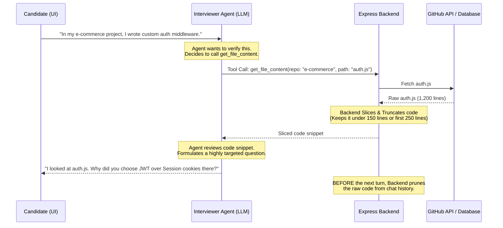

# Interview Agent: Tool Architecture & Large File Handling

This document outlines the tool (function-calling) architecture for the technical interviewer AI agent. It details how the agent can dynamically query the candidate's GitHub repositories and resume, how to handle large file sizes without exceeding context limits, and how to maintain low latency.

---

## 1. System Architecture Diagram



---

## 2. Recommended Agent Tools (Function Catalog)

To make the agent feel like it has complete, deep knowledge of the candidate's background, expose these tools:

### A. Code & Repository Exploration

#### 1. `get_repo_structure`
* **Purpose**: Returns the directory tree of a repository.
* **Why it's needed**: Helps the agent understand the project's architecture (e.g., MVC, monorepo, clean architecture) before opening files.
* **Parameters**:
  ```json
  { "repoName": "string" }
  ```

#### 2. `get_file_snippet`
* **Purpose**: Fetches a specific line range from a file.
* **Why it's needed**: Allows the agent to review implementation details.
* **Parameters**:
  ```json
  {
    "repoName": "string",
    "filePath": "string",
    "lineStart": "number",
    "lineEnd": "number"
  }
  ```

#### 3. `get_file_outline`
* **Purpose**: Parses a file and returns only function names, classes, methods, and their line numbers.
* **Why it's needed**: Lets the agent "scan" a large 3,000-line file instantly without reading the code, allowing it to request a specific function's line range later.
* **Parameters**:
  ```json
  { "repoName": "string", "filePath": "string" }
  ```

#### 4. `search_code_in_repo`
* **Purpose**: Searches a repository for a keyword (e.g. `"jwt"`, `"bcrypt"`, `"sql"`, `"cache"`).
* **Why it's needed**: If the candidate claims *"I optimized database queries in Y project"*, the agent can search for `"Query"` or `"select"` to find the database module.
* **Parameters**:
  ```json
  { "repoName": "string", "query": "string" }
  ```

---

### B. Experience & History Verification

#### 5. `get_recent_commits`
* **Purpose**: Gets the last 5 commit messages in a project.
* **Why it's needed**: Allows the agent to ask about recent work and active problem-solving (e.g., *"I noticed your last commit was a bugfix for webhook timeouts. What caused that?"*).
* **Parameters**:
  ```json
  { "repoName": "string" }
  ```

#### 6. `search_resume`
* **Purpose**: Queries the parsed resume text for specific terms or sections.
* **Why it's needed**: Allows the agent to quickly lookup candidate claims (e.g., past job titles, specific certifications) during the conversation.
* **Parameters**:
  ```json
  { "query": "string" }
  ```

---

## 3. Large File Handling Strategies

To prevent latency spikes, high costs, and LLM confusion, implement these three backend strategies:

### Strategy 1: The 3,000-Line Limit & Truncation Fallback
Files larger than 3,000 lines (e.g., bundles or huge tables) should never be sent in full. Instead of failing, the backend should return the **first 250 lines** (containing imports and main classes) along with a truncation notice.

```javascript
// Example Backend Logic for get_file_snippet
function processFileContent(rawCode, requestedStart = 1, requestedEnd = 100) {
  const lines = rawCode.split('\n');
  
  // Hard limit file length checks
  if (lines.length > 3000) {
    const headerSnippet = lines.slice(0, 250).join('\n');
    return `[File Truncated: Showing first 250 of ${lines.length} lines. The file is too large to load in full.]\n${headerSnippet}\n[System Note: Advise the candidate to describe this module conceptually.]`;
  }
  
  // Normal slicing
  const start = Math.max(1, requestedStart) - 1;
  const end = Math.min(lines.length, requestedEnd);
  return lines.slice(start, end).join('\n');
}
```

### Strategy 2: Pre-formatted Line Numbers
Always prepending line numbers (e.g. `42: const user = getUser()`) before returning code to the LLM helps the agent refer to exact lines of code in its questions.

### Strategy 3: Chat History Pruning (The "Slide-and-Replace" Pattern)
Once the LLM uses a fetched code snippet to generate its question, the raw code is no longer needed. **Prune it on the backend before the next turn.**

Replace the large code chunk in your messages array with a placeholder:

```javascript
function pruneHistory(messages) {
  return messages.map(msg => {
    // If this message contains fetched code content
    if ((msg.role === 'tool' || msg.role === 'function') && msg.content.includes('[File:')) {
      const firstLine = msg.content.split('\n')[0]; // e.g. "[File: auth.js]"
      return {
        ...msg,
        content: `${firstLine} - Raw code block omitted from history to maintain speed.`
      };
    }
    return msg;
  });
}
```

---

## 4. Key Performance Indicators (KPIs)

* **Prefill Latency**: Keeping the prompt history under **4,000 tokens** ensures responses are returned in under **1 second**.
* **Success Rate of Tool Calls**: Standard schemas and single-purpose tools guarantee a **>98% success rate** for function calling in modern models.
* **Cost Efficiency**: Pruning history reduces active token counts by **up to 90%** during long interviews.
